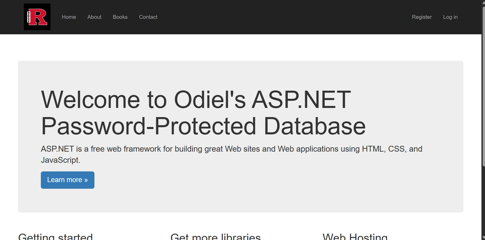
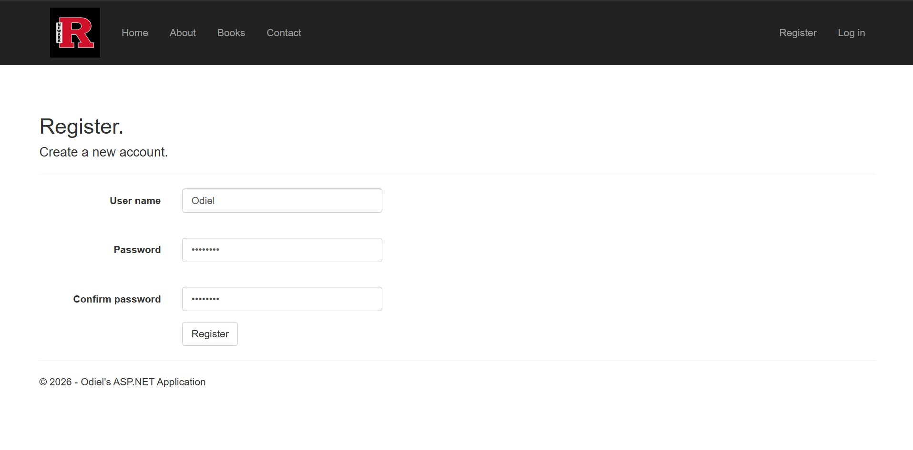
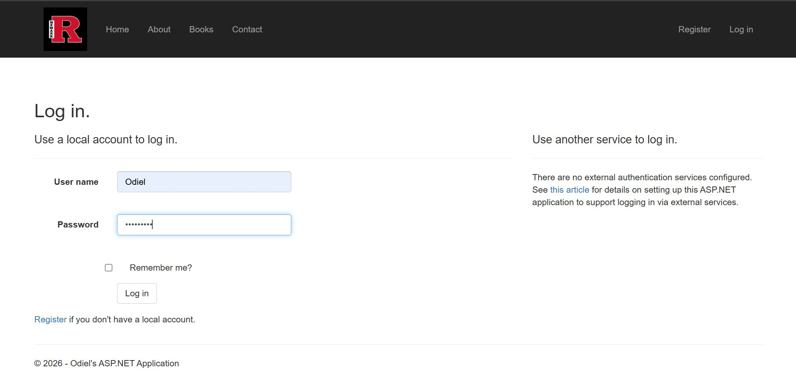
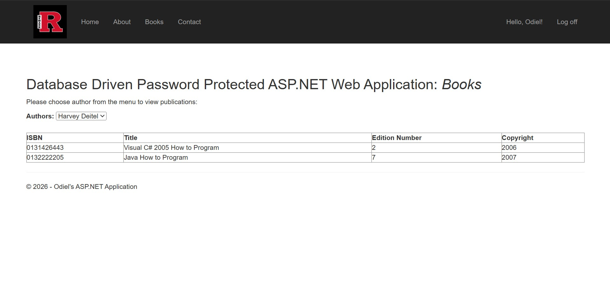
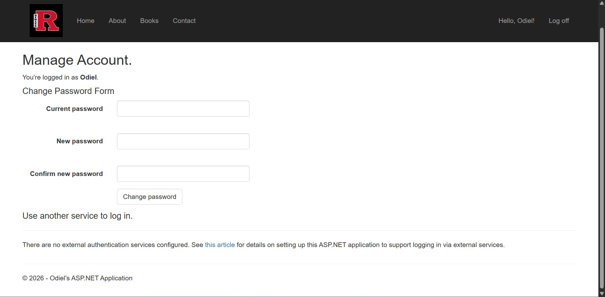

# ASP.NET Library Management System

This project is a web application built using ASP.NET Web Forms and C#. It connects to a SQL database to manage books and user access. Project includes an authentication system where registered users can access protected pages inside the ProtectedContent folder.

## Features
- Password-Protected login system
- Book database management
- ASP.NET Web Forms interface
- Structured project using c# and SQL

## Technologies used
- ASP.NET Web Forms
- C#
- SQL Server
- HTML / CSS
- Visual Studio

## Project Structure
- Account/ - user authentication pages
- App_Code/ - server-side logic
- App_Data/ - database files
- Content/ - CSS and styling
- Images/ - website images
- Scripts/ - JavaScript files

## Author
Odiel Marroquin
Computer Science Student

## Screenshots

### Homepage

### Register page

### Login page

### Books Page (Protected Content)

### User Account Management

